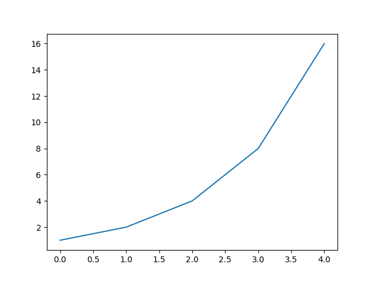

# Viewing Data

<div style="display: flex; align-items: center; margin: 20px 0;">
    <hr style="flex-grow: 0.05; border: 2px solid #009B77; margin: 0;">
    <span style="background: white; padding: 0 10px; font-weight: bold; color: #009B77;">Example:</span>
    <hr style="flex-grow: 1; border: 2px solid #009B77; margin: 0;">
</div>

```python
import pandas as pd
import json
import matplotlib.pyplot as plt

# Import the directives from prov4ml
import prov4ml.utils.prov_getters as pg

data = json.load(open(file_path))
# Get only metrics which have been collected during training phase
metric_keys = pg.get_metrics(data, keyword="TRAINING")

# Creating values dictionary
metric = pg.get_metric(data, metric_keys[0])

plt.plot(metric["value"])
plt.show()
```

<hr style="border: 2px solid #009B77; margin: 20px 0;">




<div style="display: flex; justify-content: center; gap: 10px; margin-top: 20px;">
    <a href="usage_itwinAI_logger.md" style="text-decoration: none; background-color: #006269; color: white; padding: 10px 20px; border-radius: 5px; font-weight: bold; transition: 0.3s;">← Prev</a>
    <a href="." style="text-decoration: none; background-color: #006269; color: white; padding: 10px 20px; border-radius: 5px; font-weight: bold; transition: 0.3s;">🏠 Home</a>
    <a href="reproducible_example.md" style="text-decoration: none; background-color: #006269; color: white; padding: 10px 20px; border-radius: 5px; font-weight: bold; transition: 0.3s;">Next →</a>
</div>