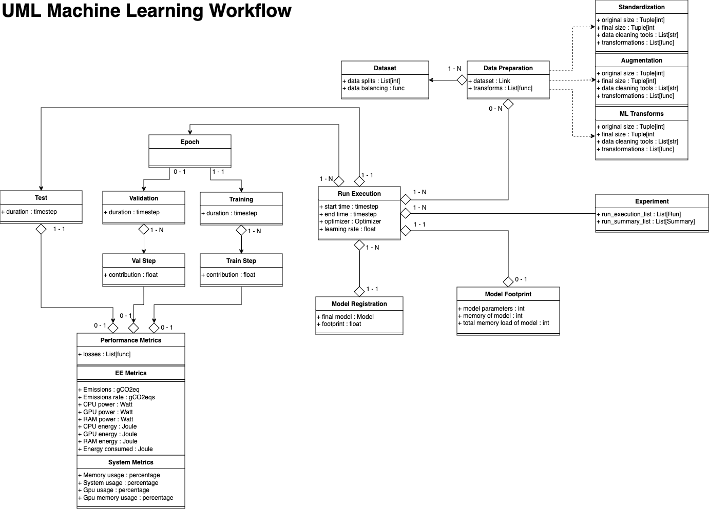

# yProv4ML

[](https://opensource.org/licenses/)

This library is part of the yProv suite, and provides a unified interface for logging and tracking provenance information in machine learning experiments, both on distributed as well as large scale experiments. 

It allows users to create provenance graphs from the logged information, and save all metrics and parameters to json format.

## Data Model



## Example


The image shown above has been generated through one of the yProv4ML use cases. Several examples are present in the [examples](./examples.md) section and provided in the ```example``` directory on [GitHub](https://github.com/HPCI-Lab/yProvML).

## Metrics Visualization


 

## Experiments and Runs

An experiment is a collection of runs where each run is a single execution of a python script. 
By changing the ```experiment_name``` parameter in the ```start_run``` function, the user can create a new experiment. 
All artifacts and metrics logged during the execution of the experiment will be saved in the directory specified by the experiment ID. Additionally, a global rank (GR) parameter is tracked, to enable the library to save data in multi-process environments.  

Several runs can be executed in the same experiment. All runs will be saved in the same directory (according to the specific experiment name and ID).

# Contributors

- [Gabriele Padovani](https://github.com/lelepado01)
- [Sandro Luigi Fiore](https://github.com/sandrofioretn)

# Former Contributors
- [Luca Davi](https://github.com/lucadavii)
- [Michael Vaccari]()

<div style="display: flex; justify-content: center; gap: 10px; margin-top: 20px;">
    <a href="." style="text-decoration: none; background-color: #006269; color: white; padding: 10px 20px; border-radius: 5px; font-weight: bold; transition: 0.3s;">← Prev</a>
    <a href="." style="text-decoration: none; background-color: #006269; color: white; padding: 10px 20px; border-radius: 5px; font-weight: bold; transition: 0.3s;">🏠 Home</a>
    <a href="installation.md" style="text-decoration: none; background-color: #006269; color: white; padding: 10px 20px; border-radius: 5px; font-weight: bold; transition: 0.3s;">Next →</a>
</div>
